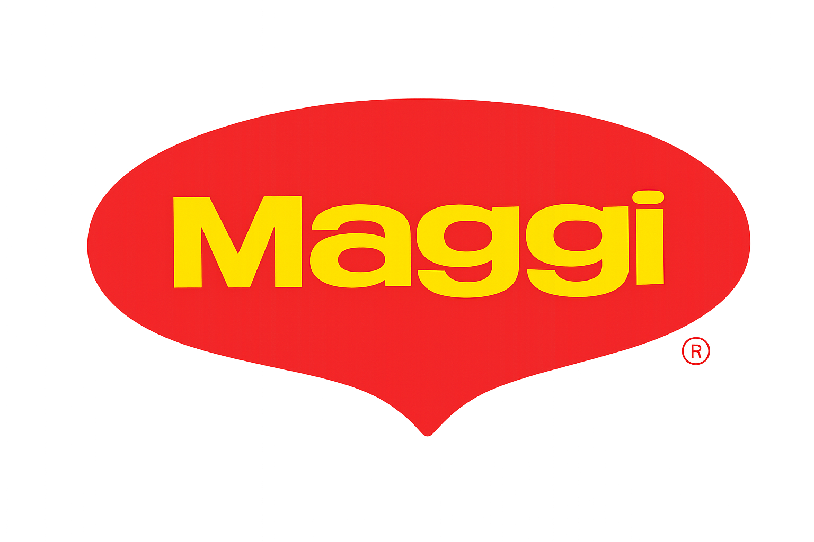

# Maggie Noodles Website

A modern, animated React website showcasing Maggi noodle products with interactive features and nutritional information.



## 🌟 Features

- **Interactive Hero Section**: Animated hero with floating vegetables, call-to-action buttons, and product highlights
- **Product Slider**: Interactive carousel showcasing different Maggi noodle varieties
- **Nutrition Information**: Detailed nutritional facts for each product variant
- **Smooth Animations**: Built with Framer Motion for fluid, engaging animations
- **Responsive Design**: Optimized for all device sizes
- **Modern UI/UX**: Clean, appetizing design with food imagery and vibrant colors

## 🍜 Product Range

The website showcases four Maggi noodle varieties:

1. **Maggi 2-Minute Noodles** - The classic original
2. **Maggi Special Masala** - Enhanced spicy flavor
3. **Maggi Veggie Masala** - Wholesome vegetable variant
4. **Maggi Chicken Noodles** - Protein-rich chicken flavor

## 🛠️ Technology Stack

- **Frontend Framework**: React 19.1.1
- **Build Tool**: Vite 7.1.0
- **Animation Library**: Framer Motion 12.23.12
- **Intersection Observer**: React Intersection Observer 9.16.0
- **Styling**: CSS with custom animations
- **Linting**: ESLint

## 📁 Project Structure

```
maggie/
├── public/
│   ├── images/          # Product images and assets
│   │   ├── maggie1.png  # Product variant images
│   │   ├── maggie2.png
│   │   ├── maggie3.png
│   │   ├── maggie4.png
│   │   ├── bowl.png     # Hero section bowl image
│   │   ├── tomato.png   # Decorative elements
│   │   ├── pea.png
│   │   └── basil1.png
│   └── vite.svg
├── src/
│   ├── components/
│   │   ├── Hero.jsx     # Main hero section
│   │   ├── Hero.css     # Hero styling
│   │   ├── Navbar.jsx   # Navigation component
│   │   ├── Navbar.css   # Navbar styling
│   │   ├── Slider.jsx   # Product carousel
│   │   └── Slider.css   # Slider styling
│   ├── App.jsx          # Main application component
│   ├── App.css          # Global styles
│   ├── main.jsx         # Application entry point
│   └── index.css        # Base styles
├── package.json         # Dependencies and scripts
├── vite.config.js       # Vite configuration
└── eslint.config.js     # ESLint configuration
```

## 🚀 Getting Started

### Prerequisites

- Node.js (version 18 or higher)
- npm or yarn package manager

### Installation

1. **Clone the repository**
   ```bash
   git clone <repository-url>
   cd maggie
   ```

2. **Navigate to project directory**
   ```bash
   cd project
   ```

3. **Install dependencies**
   ```bash
   npm install
   ```

### Development

1. **Start the development server**
   ```bash
   npm run dev
   ```

2. **Open your browser**
   Navigate to `http://localhost:5173` to view the website

### Build for Production

```bash
npm run build
```

The built files will be in the `dist` directory.

### Preview Production Build

```bash
npm run preview
```

## 🎨 Customization

### Adding New Products

To add a new Maggi product variant, edit the `slides` array in `src/components/Slider.jsx`:

```javascript
const slides = [
  // ... existing products
  {
    image: '/images/new-product.png',
    name: 'Maggi New Variant',
    desc: 'Product description here...',
    nutrition: { 
      energy: 300, 
      protein: 6.0, 
      // ... other nutrition values
    }
  }
];
```

### Styling

- Hero section styles: `src/components/Hero.css`
- Slider styles: `src/components/Slider.css`
- Navbar styles: `src/components/Navbar.css`
- Global styles: `src/App.css` and `src/index.css`

### Animations

Animations are powered by Framer Motion. Key animation variants are defined in:
- `Hero.jsx`: Hero section animations
- `Slider.jsx`: Carousel transitions

## 📱 Responsive Breakpoints

The website is designed to be fully responsive with breakpoints for:
- Mobile devices (up to 768px)
- Tablets (768px - 1024px)
- Desktop (1024px+)

## 🧪 Linting

Run ESLint to check for code quality issues:

```bash
npm run lint
```

## 🤝 Contributing

1. Fork the repository
2. Create a feature branch (`git checkout -b feature/amazing-feature`)
3. Commit your changes (`git commit -m 'Add some amazing feature'`)
4. Push to the branch (`git push origin feature/amazing-feature`)
5. Open a Pull Request

## 📄 License

This project is open source and available under the [MIT License](LICENSE).

## 📞 Support

For support and questions about this project, please open an issue on GitHub.

---

*Built with ❤️ using React and Framer Motion*
